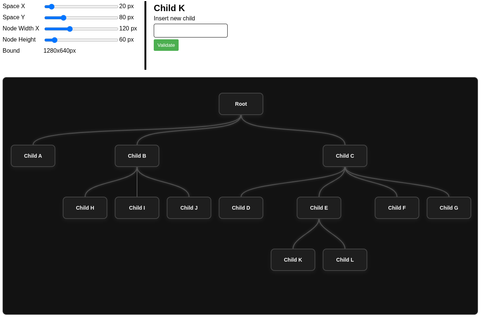

# @modernik/react-mlm-tree-view

> **Bibliothèque React légère et extensible permettant de générer des arbres hiérarchiques de type marketing de réseau (MLM) avec un rendu HTML stylisé prêt à l'emploi.**

---

Ce projet est une **bibliothèque frontend** conçue pour compléter le projet backend [`modernik/mlm-tree-view`](https://github.com/Modernik-Ing/mlm-tree-view) écrit en PHP.  
Il permet d’intégrer facilement une **visualisation interactive** et **moderne** d’un arbre MLM dans toute application React.

---

## Objectif

- Offrir un **moteur d'affichage interactif** de structures MLM côté frontend.
- Rendre la visualisation **réutilisable**, **personnalisable** et **compatible** avec la structure JSON produite par des APIs tiers.
- Faciliter l'intégration dans des **applications web riches (SPA)** basées sur React.

---

## Installation

```bash
yarn add @modernik-ing/react-mlm-tree-view
# ou
npm install @modernik-ing/react-mlm-tree-view
````

---

## Utilisation de base

```tsx
import React, {FunctionComponent, useEffect} from 'react'
import {useCenteredTreeLayout, type TreeNode, TreeView, PositionedTreeNode} from '@modernik-ing/react-mlm-tree-view';

const data: TreeNode = {
    id: 1,
    name: 'Root',
    children: [
        {id: 2, name: 'Child A'},
        {
            id: 3, name: 'Child B',
            children: [
                {id: 9, name: 'Child H'},
                {id: 10, name: 'Child I'},
                {id: 11, name: 'Child J'},
            ]
        },
        {
            id: 4, name: 'Child C',
            children: [
                {id: 5, name: 'Child D'},
                {
                    id: 6, name: 'Child E',
                    children: [
                        {id: 12, name: 'Child K'},
                        {id: 13, name: 'Child L'},
                    ]
                },
                {id: 7, name: 'Child F'},
                {id: 8, name: 'Child G'},
            ]
        },
    ],
}

const App: FunctionComponent = () => {
    const {setRoot, rootNode, bound, orientation} = useCenteredTreeLayout();

    useEffect(() => {
        setRoot(data);
    }, []);

    const handleNodeClick = (node: PositionedTreeNode): void => {
        console.log(node, node.node)
    }

    return (
        <TreeView root={rootNode} orientation={orientation} bound={bound} onClick={handleNodeClick}/>
    );
}

export {
    App
}
```

---

## Fonctionnalités prévues

* Personnalisation des couleurs, formes et styles des nœuds
* Zoom et déplacement (pan)
* Animations de transition
* Support responsive pour mobiles
* Composants internes réutilisables pour une intégration avancée

---

## Développement local

```bash
yarn install
yarn dev
```

Ouvre ensuite : [http://localhost:5173](http://localhost:5173)


---

## Structure du projet

```
react-mlm-tree-view/
├── src/                 # Code source de la bibliothèque
│   ├── component/       # Composants React internes
│   ├── hook/            # Hooks React internes
│   └── index.ts         # Point d’entrée de la lib
│   └── structure.ts     # Definitifion des types (structure des données)
│   └── app.tsx          # Exemple / tests manuels dans le navigateur
├── index.html           # point d'entré pour lencer l'exemple
├── tsconfig.json
├── vite.config.ts       # Pour le dev & test
├── tsup.config.ts       # Pour le build de la lib
```

---

## Licence

Ce projet est sous licence MIT — vous pouvez l’utiliser librement dans vos projets personnels ou commerciaux.

MIT © [Modernik-Ing](https://github.com/Modernik-Ing)

